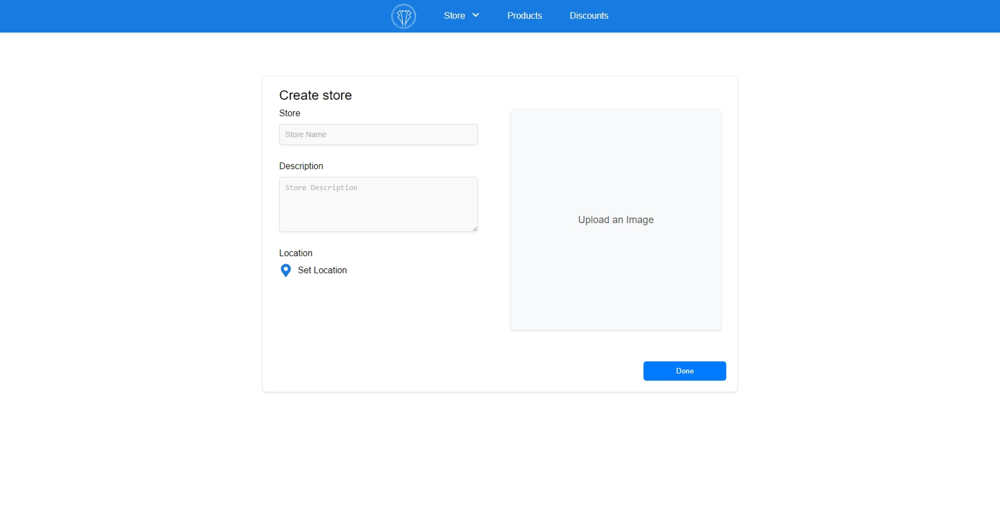
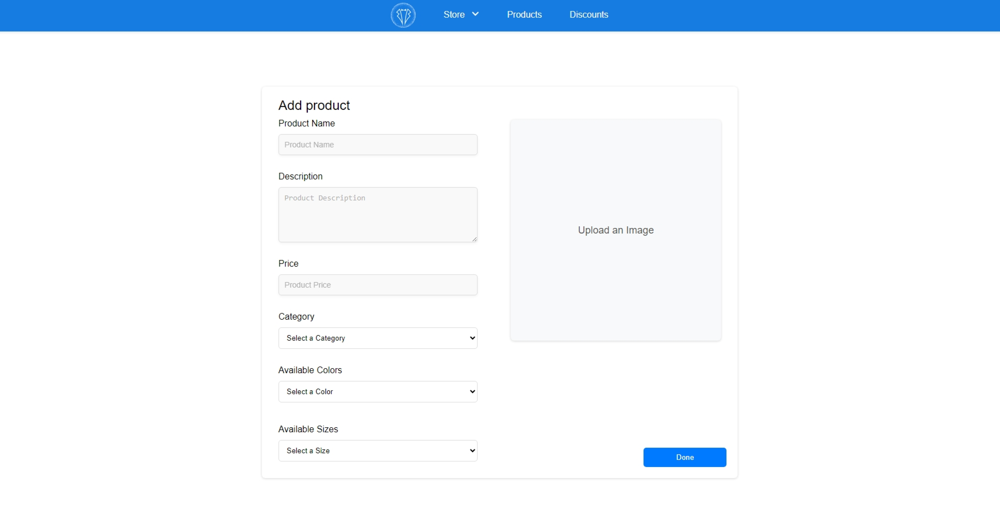
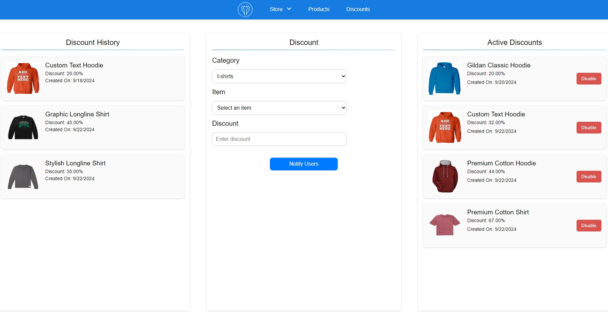

<br><br>

<!-- project philosophy -->


> A mobile app that combines the best of Lebanese clothing into a single, easy-to-use application. By leveraging advanced AI technology, we strive to enhance the shopping experience, foster local businesses, and connect customers with high-quality, unique items from across Lebanon.
>
> Vesti aims to become the leading digital marketplace in Lebanon, offering a seamless shopping experience that brings together a diverse range of products from local stores and artisans. We aim to celebrate and promote Lebanese culture and craftsmanship while providing unparalleled convenience and accessibility to our users.

### User Stories

#### &nbsp; &nbsp; &nbsp; &nbsp; &nbsp; As a User:

- I want to browse different categories of products, so that I can easily find items I am interested in.
- I want to receive automatic notifictions so that i can know if a store nearby is making any discounts.
- I want to be able to upload an image and see similar products of it using ai search engine.
- I want to see personalized product recommendations, so that I can discover items that match my tastes and preferences.
- I want to view detailed information about a product, including images, descriptions, sizes, so that I can make informed purchasing decisions.
- I want to add products to my shopping cart, so that I can review my selections before purchasing.
- I want to choose from multiple payment options, including credit card, PayPal, and cash on delivery, so that I can pay in the most convenient way for me.

#### &nbsp; &nbsp; &nbsp; &nbsp; &nbsp; As a Store:

- I want to be able to upload the store image, name, description and location.
- I want to be able to upload products with image, price, description, colors, and sizes.
- I want to be able to add discounts on products and view active and inactive discounts.
- I want to be able to send notifications to customers ing=forming them of a discount.

<br><br>

<!-- Tech stack -->


### Vesti is built using the following technologies:

- This project uses the [Flutter app development framework](https://flutter.dev/). Flutter is a cross-platform hybrid app development platform which allows us to use a single codebase for apps on mobile, desktop, and the web.
- The app uses a trained model for similarity detection using FAISS, enabling efficient and scallable similarity searches across large datasets.
- For persistent storage (database), the app uses the [Postgre SQL](https://www.postgresql.org/) , the app uses the sequelize ORM package, allowing the app to define custom models and seamlesly store them in a Postgresql database.
- To send automatic notifications, the app uses the [firebase Cloud Messaging](https://firebase.google.com/docs/cloud-messaging/), a service that enables reliable, real-time, and event-driven communication between the app and user's device.
- For the stores web app, the app uses the React Leaflet package, an open-source library for creating interactive maps, while the mobile app integrates flutter_OpenStreetMap to display maps and retrieve the user's location.
- This project is built with ReactJS, a JavaScript library focused on creating dynamic, component-based user interfaces.
- The app uses the font ["Poppins"](https://fonts.google.com/specimen/Poppins) as its main font, and the design of the app adheres to the material design guidelines.

<br><br>

<!-- UI UX -->


> We designed Vesti using wireframes, iterating on the design until we reached the ideal layout for easy navigation and a seamless user experience.

- Project Figma design [figma](https://www.figma.com/design/IV03weUBysFlCVYp1xjnIF/Untitled?node-id=0-1&node-type=canvas&t=xaNgsgUaaCiIkGG7-0)

### Mockups

| Home screen                             | Menu Screen                           | Order Screen                          |
| --------------------------------------- | ------------------------------------- | ------------------------------------- |
|  |  |  |

<br><br>

<!-- Database Design -->


### Architecting Data Excellence: Innovative Database Design Strategies:


<br><br>

<!-- Implementation -->


### User Screens (Mobile)

| Login screen                                       | Register screen                       | Landing screen                     | Nearby stores screen                  |
| -------------------------------------------------- | ------------------------------------- | ---------------------------------- | ------------------------------------- |
|  |     |    |     |
| AI Search Engine screen                            | Profile Screen                        | Cart Screen                        | Payment Screen                        |
|            |  |  |  |

### Stores Screens (Web)

| Login screen                              | Signup screen                            | View Store screen                       |
| ----------------------------------------- | ---------------------------------------- | --------------------------------------- |
|  |  |  |
| Edit Store screen                         | Add Products Screen                      | Discounts Screen                        |
|  |  |  |

<br><br>

<!-- Prompt Engineering -->


### Mastering AI Interaction: Unveiling the Power of Prompt Engineering:

- This project uses advanced prompt engineering techniques to optimize the interaction with natural language processing models. By skillfully crafting input instructions, we tailor the behavior of the models to achieve precise and efficient language understanding and generation for various tasks and preferences.

<br><br>

<!-- AWS Deployment -->


### Efficient AI Deployment: Unleashing the Potential with AWS Integration:

- This project leverages AWS deployment strategies to seamlessly integrate and deploy natural language processing models. With a focus on scalability, reliability, and performance, we ensure that AI applications powered by these models deliver robust and responsive solutions for diverse use cases.

<br><br>

<!-- Unit Testing -->


### Precision in Development: Harnessing the Power of Unit Testing:

- This project employs rigorous unit testing methodologies to ensure the reliability and accuracy of code components. By systematically evaluating individual units of the software, we guarantee a robust foundation, identifying and addressing potential issues early in the development process.

<br><br>

<!-- How to run -->


> To set up Coffee Express locally, follow these steps:

### Prerequisites

This is an example of how to list things you need to use the software and how to install them.

- npm
  ```sh
  npm install npm@latest -g
  ```

### Installation

_Below is an example of how you can instruct your audience on installing and setting up your app. This template doesn't rely on any external dependencies or services._

1. Get a free API Key at [example](https://example.com)
2. Clone the repo
   git clone [github](https://github.com/your_username_/Project-Name.git)
3. Install NPM packages
   ```sh
   npm install
   ```
4. Enter your API in `config.js`
   ```js
   const API_KEY = "ENTER YOUR API";
   ```

Now, you should be able to run Coffee Express locally and explore its features.
